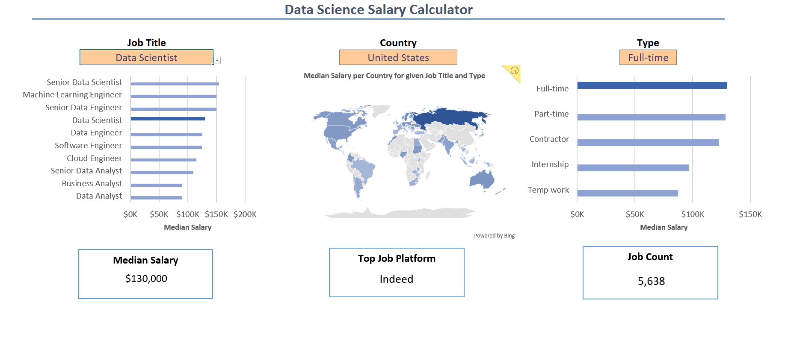
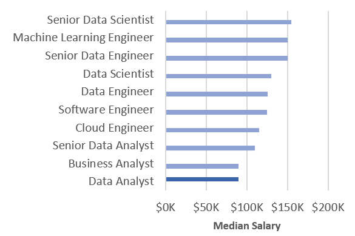
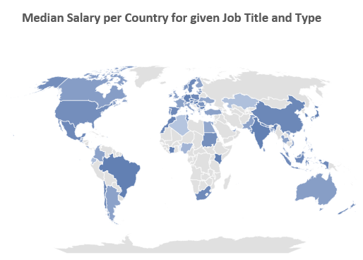
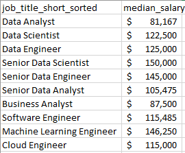
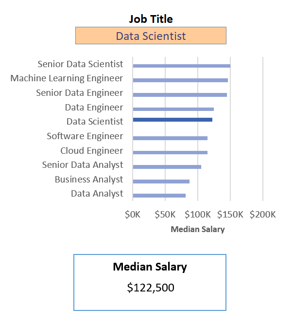
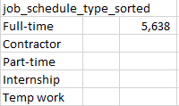
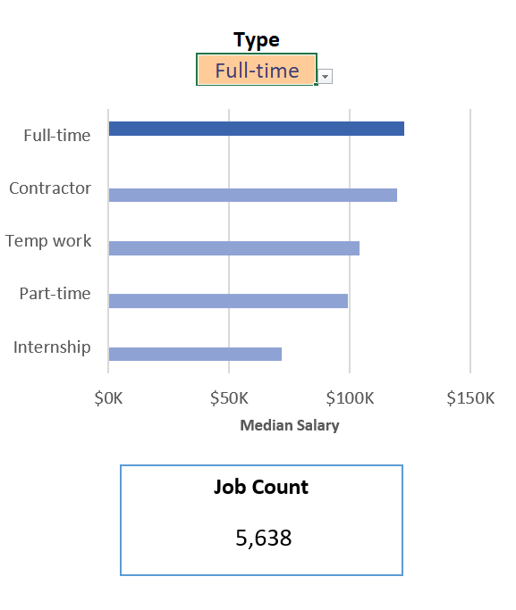
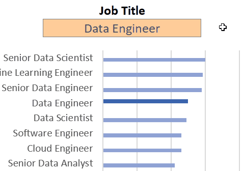

# Project 1 - Excel Salary Dashboard

 

## Introduction

 This dashboard was created to serve as guidance for job seekers to investigate salaries for several Data Science jobs in several contries.  

### Dashboard File
 My final dashboard is in [Salary_Dashboard.xlsx](Salary_Dashboard.xlsx).

### Excel Skills Used

 The following Excel skills were utilized on this project:

 - 📉 **Charts**
 - 🧮 **Formulas and Functions**
 - ❎ **Data Validation**

### Data Jobs Dataset
 The Dataset utilized on this project and more information about it can be found [here](../Resources/Dataset).

## Dashboard Build

 This section goes over each of the *Excell Skills Used* to show how and why they were used, and what insights they give.

### 📉 Charts

#### 📊 Data Science Job Salaries - Bar Chart

 

 - Horizontal bar charts are good for visual comparison like Median Salary of different jobs.
 - Organizing the chart in descending order by salary improves readability.
 - This enables quick identification of salary trends, noting that Senior roles and Engineers are higher-paying than Analyst roles.

#### 🗺️ Country Median Salary - Map Chart

 
 
 - Color-coded map to visually differentiate salary levels across regions.
 - Improved readability and immediate understanding of geographic salary trends.
 - Enables quick grasp of global salary disparities and highlights high/low salary regions.

### 🧮 Formulas and Functions

#### 💰 Median Salary
```
=MEDIAN(
    IF((jobs[job_title_short]=title)*
        (jobs[job_country]=country)*
        (ISNUMBER(SEARCH(type,jobs[job_schedule_type]))),
        jobs[salary_year_combined])
)
```

 - This formula provides specific salary information for given job titles, regions, and schedule types.
 - Utilizes `MEDIAN()` function with nested `IF()` statement to analyze an array.
 - The condition section of the `IF()` statement does a multiplication of the binary result of three verifications of the variables **title**, **country** and **type**.
 - This formula can be used to populate the table below, returning the median salary based on job title, country, and type specified.
 - In this case, **country** and **type** are fixed parameters where **title** varies based on the column *job_title_short_sorted*.

 **Background Table**

 

 **Dashboard Implementation**

 

#### ⏰ Count of Job Schedule Type

 ```
 =FILTER(J2#,
    NOT(ISNUMBER(SEARCH("and",J2#)))*
    NOT(ISNUMBER(SEARCH(",",J2#)))*
    (J2#<>0)
)
 ```

 - This Excel formula below uses the `FILTER()` function to exclude entries containing "and" or commas, and omit zero values.
 - This formula populates the table below, which gives us a list of unique job schedule types.
 
 **Background Table**

 
 
 **Dashboard Implementation**

 

### ❎ Data Validation

#### 🔍 Filtered List  

 

 - Implementing the filtered list as a data validation rule for the `Job Title`, `Country`, and `Type` options in the dashboard ensures:
     - User input is restricted to predefined, validated job tittles, countries and schedule types.
     - Incorrect or inconsistent entries are prevented.
     - Overall usability of the dashboard is enhanced.

## Conclusion

 I created this dashboard to showcase insights into salary trends across various data-related job titles. It allows users to make informed decisions about their career paths. Exploring the functionalities to understand how location and job type influence salaries.
