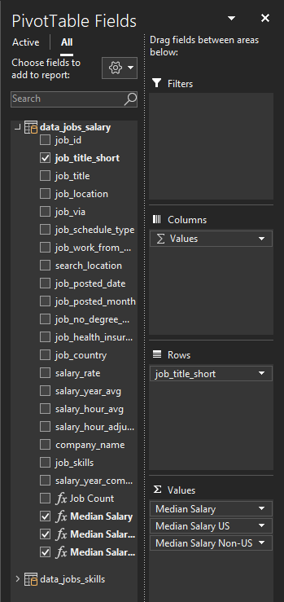

# Projeto 2 - Análise em Salários e Habilidades

## Introdução

 Seguindo a mesma ideia de ajudar candidatos do primeiro projeto, dessa vez eu me concentrei mais nas habilidades requiridas das ofertas de emprego do mesmo [dataset](../Resources/Dataset) usado anteriormente, onde eu procurei saber qual são as habilidades mais populares entre diferentes empregos e quais delas tem o maior pagamento.

### Perguntas a serem Respondidas
 
 Para entender melhor o mercado de trabalho em Ciência de Dados, eu criei as seguintes questões:

 1. **Qual é o salário de cargos em ciência de dados em diferentes regiões?**
 2. **Quais habilidades dos profissionais em dados são as mais utilizadas?**
 3. **Qual é o salário das 10 habilidades mais populares?**
 4. **Ter mais habilidades significa melhor salário?**

### Habilidades do Excel usadas

 As seguintes habilidades em Excel foram usadas neste projeto:

 - **📊 Pivot Tables**
 - **📈 Pivot Charts**
 - **🧮 DAX (Data Analysis Expressions)**
 - **🔍 Power Query**
 - **⚙️ Power Pivot**

### Dataset de Ofertas de Emprego
 O Dataset utilizado nesse projeto e mais informações sobre o mesmo pode ser econtrado [aqui](../Resources/Dataset).

## Processando os dados

### Habilidade: Power Query (ETL)
 
#### 📥 Extrair

 - Primeiro eu usei o Power Query para extrair os dados originais (`data_salary_all.xlsx`) e criei duas queries:
    - **data_jobs_salary:** Contendo todas as informações das ofertas de emprego do dataset.
    - **data_jobs_skills:** Listando todas as habilidades associadas a cada cargo.

#### 🔄 Transformar

 - Então, eu transformei cada uma das queries mudando tipos de colunas, removendo colunas desnecessárias, adicionando novas colunas, formatando colunas existentes, limpando textos para eliminar palavras específicas e removendo espaços em branco.
    
    - data_jobs_salary
        
        

    - data_jobs_skills

        

#### 🔗 Carregar
 - Finalmente, eu carreguei ambas queries transformadas no workbook do excel, criando a fundação para as análises.

    - data_jobs_salary

        

    - data_jobs_skills

        


### Habilidade: Power Pivot

#### ⚙️ Power Pivot

 - Eu criei o modelo de dados integrando as duas queries `data_jobs_all` e `data_jobs_skills`.
 - Considerando que eu já limpei os dados usando Power Query, Power Pivot criou uma relação entre as duas tabelas.

#### 🔗 Modelos de Dados

 - A relação criada entre as duas cabelas foi de *um para muitos* pela coluna `job_id`.

 

 - Com o modelo de dados estabelecido on Power Pivot, nós podemos agora usar DAX para criar medidas que vão ser usadas nas análises.

## 1️⃣ Qual é o salário de cargos em ciência de dados em diferentes regiões?

### Habilidade: Pivot Tables & DAX

#### 📊 Pivot Table
 
 - Eu criei uma PivotTable usando o modelo de dados feito com Power Pivot.
 - Para as linhas da tabela eu usei a coluna `job_title_short`, assim eu consigo filtrar todos os cargos. E para os valores eu criei 3 medidas usando DAX.

   

#### 🧮 DAX

 - Salário Mediano (Median Salary)

 ```
 =MEDIAN(data_jobs_salary[salary_year_combined])
 ```

 - Salário Mediano para países diferentes do EUA (Median Salary for non-US countries)

 ```
 =CALCULATE([Median Salary], data_jobs_salary[job_country]<>"United States")
 ```
 
 - Salário Mediano no EUA (Median Salary on the US)

 ```
 =CALCULATE([Median Salary], data_jobs_salary[job_country]="United States")
 ```
 
### 📊 Análise

#### 💡 Insights

 - Cargos como Engenheiro de Dados Senior e Cientista de Dados Senior tem um salário mediano maior em ambos nos EUA e internacionalmente, mostrando a demanda global por especialistas de alto nível em dados.

 - Agora comparando o salário mediano no Brasil com o dos EUA e do restante dos países, a diferença não é sempre negativa para todos os cargos, o que pode indicar um crescimento na demanda de certos profissionais, como por exemplo Engenheiro de Software e Engenheiro de Dados.

 

## 2️⃣ Quais habilidades dos profissionais em dados são as mais utilizadas?

 - Para essa análise e criei um Pivot Chart de uma Pivt Table.

### 📊 Análise

#### 💡Insights

 - SQL e Python são as habilidades mais populares em empregos de ciência de dados, refletindo sua importância em processamento de dados e análises.
 - Tecnologias emergentes como AWS e Azure também mostram presença significativa, realçando a mudança da indústria para serviços na nuvem.

 

## 3️⃣ Qual é o salário das 10 habilidades mais populares?

### Habilidade: Gráficos Avançados com Pivot Chart

 - Para essa análise eu criei um Pivot Chat combo que plota o salário mediano de habilidades e a probabilidade dela ser um requerimento em ofertas de emprego de dados.
    - **Eixo Primário:** Median Salary (Gráfico de barras vertical)
    - **Eixo Secundário:** Skill Likelihood (marcadores em forma de losango)

### 📊 Análise

#### 💡Insights

 - Assim como na análise anterior, podemos ver a tendência dos serviçõs na nuvem Spark, AWS e Azure pelo alto salário mediano e a baixa *skill likelihood*.
 - Por outro lado, habilidades como Python e SQL que tiveram uma alta *skill likelihood* e um salário mediano médio comparado com outras, nos mostra a sua importância em cargos de ciência de dados.

 

 - Esse gráfico destaca a importância em investir tempo aprendendo novas habilidades de alto nível, que estão evidentimente relacionadas com maiores salários.

## 4️⃣ Ter mais habilidades significa melhor salário?

### 📊 Análise

#### 💡 Insights

 - Existe uma correlação positiva entre o número de habilidades requiridas em uma oferta de emprego e o salário mediano como se pode ver pela linha de tendência no gráfico, particularmente cargos como Engenheiro de Dados Senior e Cientista de Dados Senior.
 - Cargos que requerem menos habilidades, como Analista de Negócios, tendem a ofertar salários menores, o que sugeste que um conjunto de habilidades mais especializadas significa um maior valor de mercado.

 

 - Isso enfatiza o valor de aprender habilidades relevantes, principalmente para aqueles buscando cargos com alto salário.

# Conclusão

 Usando um dataset com dados reais em ofertas de emprego, eu analisei cargos, salários, países e habilidades essenciais. Utilizazndo recursos do Excel como Power Query, Pivot Table, DAX e gráficos, eu descobri correlações importantes entre diversas habilidades e altos salários, particularmente Python, SQL e tecnologias de nuvem.
