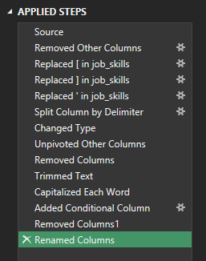

# Project 2 - Analysis

## Introduction

 Following the same idea of helping job seekers from the first project, this time I focused more on the skills required in the job postings of the same [dataset](../Resources/Dataset), to find what are the most popular skills among diferents jobs and which of them have the highest pay.  

### Questions to Analyze
 
 To understand the data science job market, I asked the following:

 1. **Do more skills get you better pay?**
 2. **What’s the salary for data jobs in different regions?**
 3. **What are the top skills of data professionals?**
 4. **What’s the pay for the top 10 skills?**

### Excel Skills Used

 The following Excel skills were utilized for this analysis:

 - **📊 Pivot Tables**
 - **📈 Pivot Charts**
 - **🧮 DAX (Data Analysis Expressions)**
 - **🔍 Power Query**
 - **⚙️ Power Pivot**

### Data Jobs Dataset
 The Dataset utilized on this project and more information about it can be found [here](../Resources/Dataset/data_jobs_salary_all.xlsx).

## Processing the Data

 On this section I will go over some of the steps performed to process the data before answering the Questions to Analyze.

### Skill: Power Query (ETL)

#### 📥 Extract

 - First, I used Power Query to extract the original data (`data_salary_all.xlsx`) and create two queries:
    - **data_jobs_salary:** First one with all the data jobs information from the dataset.
    - **data_jobs_skills:** The second listening the skills for each job ID.

#### 🔄 Transform

 - Then, I transformed each query by changing column types, removing unnecessary columns, adding new columns, formating existing columns, cleaning text to eliminate specific words, and trimming excess whitespace.

    - data_jobs_salary
        
        

    - data_jobs_skills

        

#### 🔗 Load

 - Finally, I loaded both transformed queries into the workbook, setting the foundation for my subsequent analysis.

    - data_jobs_salary

        

    - data_jobs_skills

        


### Skill: Power Pivot

#### ⚙️ Power Pivot

 - I created a data model by integrating the `data_jobs_all` and `data_jobs_skills` tables into one model.
 - Since I had already cleaned the data using Power Query; Power Pivot created a relationship between these two tables.

#### 🔗 Data Model

 - The relationship created between the two tables was a *one to many* by the `job_id` column.

 

#### 📃 Power Pivot Menu

 - With the Data Model established on Power Pivot, we can now use DAX to create measures that will be used on the Analysis.

## 1️⃣ What’s the salary for data jobs in different regions?

### Skills: PivotTables & DAX

 - I created a PivotTable using the Data Model I created with Power Pivot.
 - I moved the `job_title_short` to the rows area so I can filter all the job titles. And for the values I created 3 measures using DAX.

#### 🧮 DAX

 - Median Salary

 ```
 =MEDIAN(data_jobs_salary[salary_year_combined])
 ```

 - Median Salary for non-US countries

 ```
 =CALCULATE([Median Salary], data_jobs_salary[job_country]<>"United States")
 ```
 
 - Median Salary on the US

 ```
 =CALCULATE([Median Salary], data_jobs_salary[job_country]="United States")
 ```
 
### 📊 Analysis

#### 💡 Insights

 - Job roles like Senior Data Engineer and Senior Data Scientist have higher median salaries both in the US and internationally, showcasing the global demand for high-level data expertise.
 - Comparing with median salaries on Brazil, the disparity between US and Non-US roles is not always negative for every job title, which might be a growth on the demand of some jobs like Software Engineer and Data Engineer.

 

## 2️⃣ What are the top skills of data professionals?

 - For this analysis I created a Pivot Chart from a Pivot Table to see what are the top skills.

### 📊Analysis

#### 💡Insights

 - SQL and Python dominate as top skills in data-related jobs, reflecting their foundational role in data processing and analysis.
 - Emerging technologies like AWS and Azure also show significant presence, underlining the industry's shift towards cloud services and big data technologies.

 

## 3️⃣ What’s the pay of the top 10 skills?

### Skill: Advanced Charts (Pivot Chart)

 - I created a combo PivotChart to plot median salary and skill likelihood (%).
    - **Primary Axis:** Median Salary (as a Clustered Column)
    - **Secondary Axis:** Skill Likelihood (as a Line with Markers)

### 📊 Analysis

#### 💡Insights

 - Following the trend from the last analysis, we can see the emerging of the cloud services by looking at the high median salary and low skill likelihood of skills like Spark, AWS and Azure.
 - Meanwhile, skills like Python and SQL that have a really high skill likelihood and still a average median salary compared to the others show us again their importance in Data Science jobs.

 

 - This chart highlights the importance of investing time in learning high-value skills, which are evidently tied to higher paying roles, especially for those looking to maximize their salary in the tech industry.

## 4️⃣ Do more skills get you better pay?

### 📊 Analysis

#### 💡 Insights

 - There is a positive correlation between the number of skills requested in job postings and the median salary as you can see by the Trendline, particularly in roles like Senior Data Engineer and Data Scientist.
 - Roles that require fewer skills, like Business Analyst, tend to offer lower salaries, suggesting that more specialized skill sets command higher market value.

 

 - This trend emphasizes the value of acquiring multiple relevant skills, particularly for individuals aiming for higher-paying roles.

# Conclusion

 Using a dataset with real-world job postings, I analyzed job titles, salaries, locations, and essential skills. By utilizing Excel features like Power Query, PivotTables, DAX, and charts, I discovered key correlations between multiple skills and higher salaries, particularly in Python, SQL, and cloud technologies.
