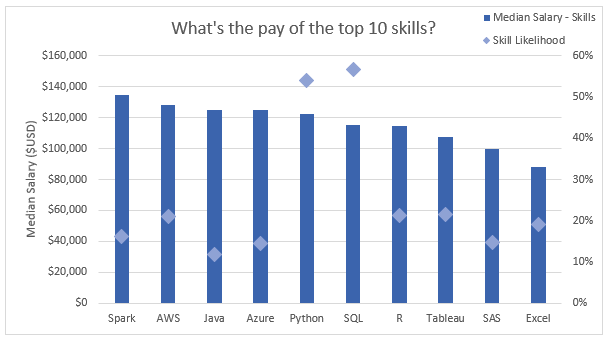

# Meus projetos de Ciência de Dados em Excel
 Este repositório contém dois projetos que eu fiz em Ciência de Dados usando Excel. Para ambos projetos eu usei uma pequena porção de um dataset do app [datanerd.tech](https://datanerd.tech/) feito por [Luke Barousse](https://www.lukebarousse.com/), que contém aproximadamente 32000 ofertas de emprego de 2023. Você pode encontrar o dataset na pasta [Dataset](Resources/Dataset) deste repositório.

## Dashboard de Salários
 Esse dashboard foi criado para servir como orientação para candidatos a emprego investigar salários para diversos empregos em Ciência de Dados em város países.
 
 [Confire meu trabalho aqui](Project_1-Dashboard)

 

## Análise em Salários e Habilidades
 Seguindo a mesma ideia de ajudar candidatos do primeiro projeto, dessa vez eu me concentrei mais nas habilidades requiridas das ofertas de emprego do mesmo [dataset](Resources/Dataset) usado anteriormente, onde eu procurei saber qual são as habilidades mais populares entre diferentes empregos e quais delas tem o maior pagamento.

 [Confire meu trabalho aqui](Project_2-Analysis)  

   